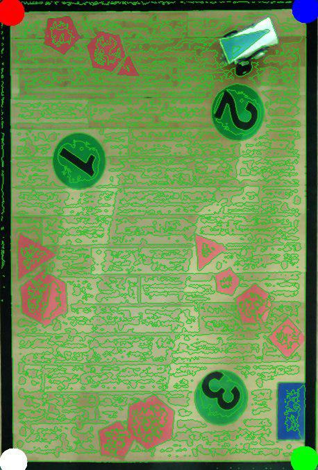
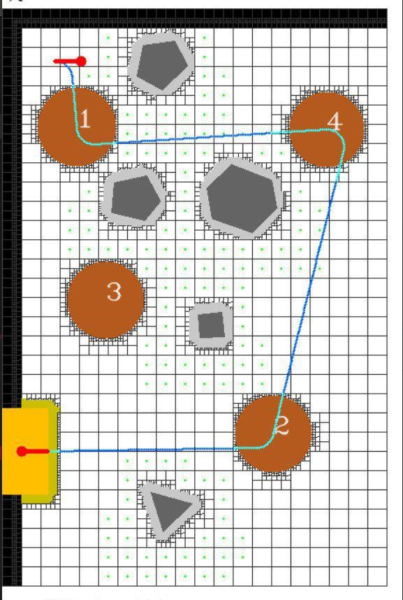
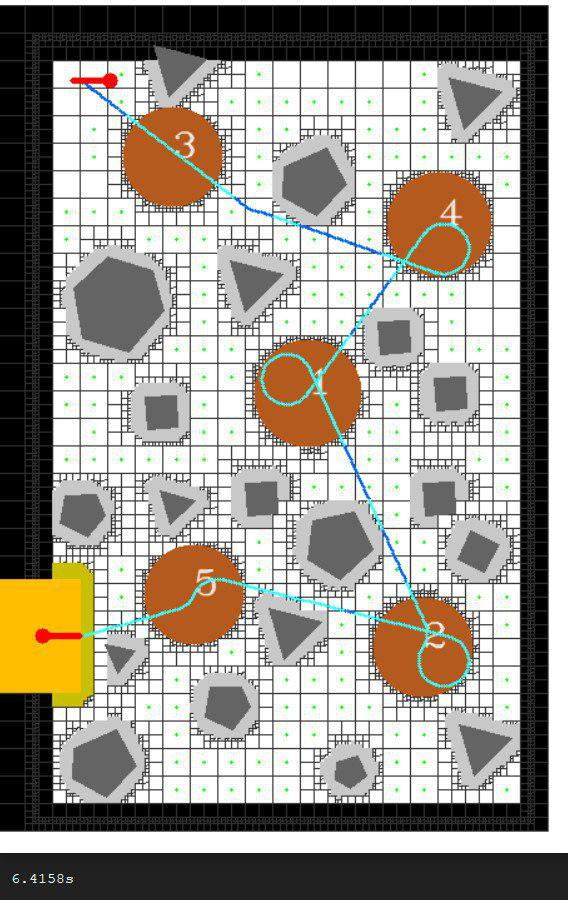

# Laboratory of Applied Robotics
This project was developed during the class of Laboratory of Applied Robotics at University of Trento.
The goal of the project was to implement from scratch algorithms of computer vision and path planning for a Lego MindStorm Robot. All the code is written in C++ using OpenCv for the computer vision part. 

## Task 

Giving a top view of image of the arena an algorithm for classification and detection of the relevant objects inside the arena was implemented (arena borders, obstacles and region of interest)

The goal of the robot were two:

* reach the exit as fast as possible considering that the green circles if it's collected they were bonus points.
* collect all the green points in numerical order (OCR algorithms for the digit detection)

## Detection and Planning

Once the arena and all the obstacles were detected, we created the map using a dynamic grid system and using that, we implemented a path planning algorithm for the robot.

    

In order to visualize the possible paths, we also implemented a visualization tool. Using that tool we were able to understand if the detection of the environment was correct and if the path planning was working properly without the needs of the physical robot.

    

We have also generated random maps with multiple obstacles for testing the path plannign algorithms.

    

 

## Robot Tracking 
In order to check the real position of the robot, we implemented also a detection algorithm and we fused that information with the one from the encoder inside the robot to let him follow the path.  

    

